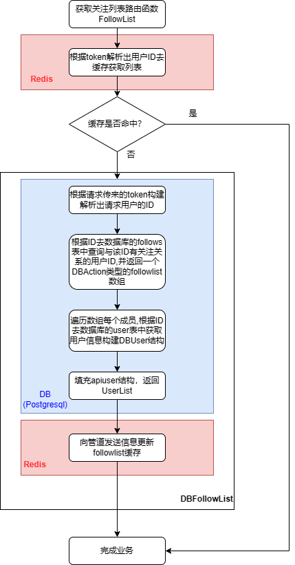
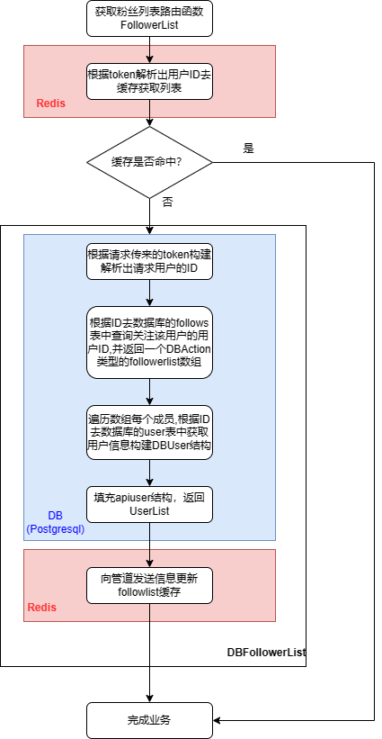
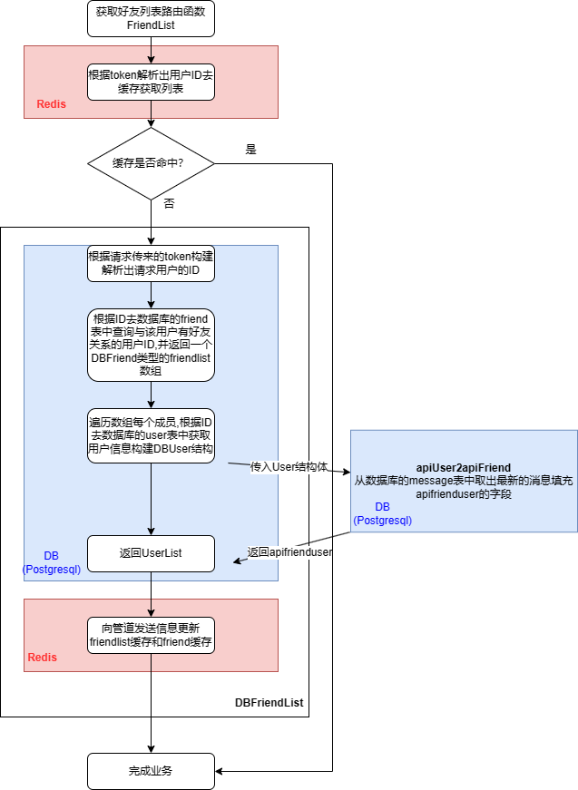
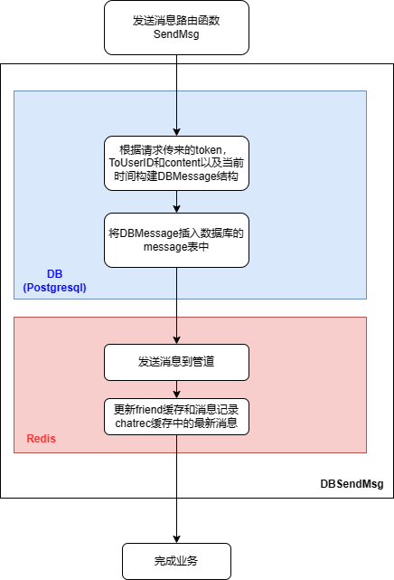
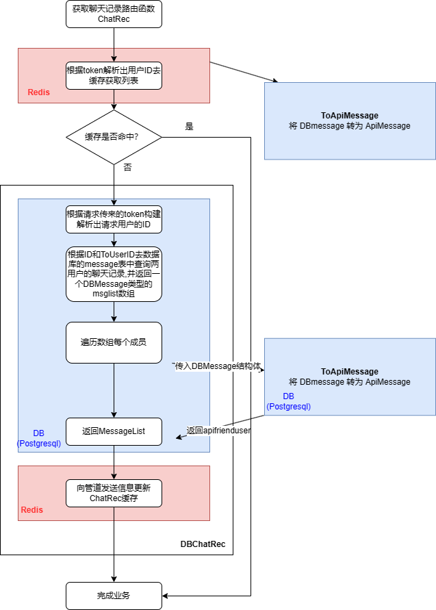

# miniDouyin

# 1 组织结构

```bash
├── biz # 除dal外，其余子文件夹由IDL生成
│   ├── dal # 数据库相关操作
│   │   ├── init.go 初始化数据库连接
│   │   ├── pg # 关系型数据库Postgresql连接和查询功能
│   │   │   ├── DbInterface.go
│   │   │   ├── DbLogic.go # 逻辑层，负责整体业务逻辑查询
│   │   │   ├── action.go # 点赞动作相关操作
│   │   │   ├── comment.go # 评论效相关操作
│   │   │   ├── defs.go # 接口定义，用于更新缓存的ipc通信
│   │   │   ├── favorite.go # 喜欢操作
│   │   │   ├── friend.go # 好有操作
│   │   │   ├── init.go # 初始化
│   │   │   ├── msg.go # 消息操作
│   │   │   ├── pgserver.go # 发送到chan更新缓存的服务器
│   │   │   ├── user.go # 用户操作
│   │   │   └── video.go # 视频操作
│   │   └── rdb
│   │       ├── handler.go # 缓存处理的业务逻辑
│   │       ├── init.go # 初始化Redis
│   │       ├── redisRelation.go # redis存储关系
│   │       ├── redisUser.go # redis存储user
│   │       └── redisVideo.go # redis存储视频
│   ├── handler
│   │   ├── miniDouyin
│   │   │   └── api
│   │   │       └── mini_douyin.go # 路由函数
│   │   └── ping.go
│   ├── model # 自动生成，定义接口数据结构等
│   └── router # 定义路由和中间件等
├── data # 静态文件：视频、头像、背景图
├── log # 日志管理
│   ├── hook.go # logrus库的hook
│   └── init.go # 初始化日志
├── main.go # 主函数
├── minidouyin.thrift # idl
├── router # 路由定义
│   ├── router.go # 路由注册
│   └── router_gen.go # 自定义路由
├── sql # 建表和插入测试数据的sql
├── test # 单元测试
└── utils
    ├── common.go # 普通功能函数
    ├── config.go # 配置文件
    ├── errors.go # 定义error
    ├── extractCover.go # 视频封面抽取
    └── messages.go # 预定义返回消息
```

# 2 组织架构

### 2.2.10 关注业务


业务逻辑如下：

- 根据用户请求关注的对方 id，更新数据库中 follows 表
- 然后更新数据库中的 friend 表将该用户设置为被关注用户的好友
- 数据库完成更新后返回状态码

### 2.2.11 获取关注列表业务



业务逻辑如下：

- 先从缓存获取关注用户的 id 集合，然后去 user 缓存获取用户信息
- 如果缓存不存在该 key，则从数据库中查询，成功后更新缓存

### 2.2.12 获取粉丝列表业务



业务逻辑如下：

- 先从缓存获取粉丝用户的 id 集合，然后去 user 缓存获取用户信息
- 如果缓存不存在该 key，则从数据库中查询，成功后更新缓存

### 2.2.13 获取好友列表业务



业务逻辑如下：

- 先从缓存获取好友用户的 id 集合，然后去 user 缓存获取用户信息
- 然后从 friend 缓存查询最新的消息和消息类型
- 如果缓存不存在相应的 key，则从数据库中查询，成功后更新缓存

### 2.2.14 发送消息业务



业务逻辑如下：

- 根据请求传来的用户 ID 和 ToID，向数据库的 message 表中插入消息内容
- 然后更新 friend 缓存中最新的消息内容

### 2.2.15 获取聊天记录业务



业务逻辑如下：

- 先从 chatrec 缓存获取消息 id 的集合
- 然后从 content 缓存获取消息内容
- 如果相应的 key 值不存在就从数据库查询

# 3 Redis 缓存设计

## 3.1 Redis 缓存设计思路

1. 对于简单的业务，每次尝试从缓存完成整个业务
2. 对于复杂的业务，其局部的查询可以借助缓存完成
3. 每次从数据库进行查找时，将查找内容更新到缓存
4. 每次写入数据库时，将新写入的内容更新到缓存
5. 缓存使用过期时间完成替换，不进行额外的缓存替换策略设计

## 3.2 缓存内容

缓存内容主要有 2 大部分

1. 将数据库表描述的结构体以 Hash 的形式存储于 Redis
2. 将数据库中的一对多关系以 Set 的形式存储于 Redis，例如：某用户关注的用户的集合、某视频的评论集合。这种 Set 中存储的是其在 Redis 中的 key（key 通常和底层数据库的主键同名）

## 3.3 缓存类型和 key 命名约定

### 3.3.1 user 缓存

该缓存描述了数据库的 users 表，是 hash 类型。

user 缓存支持同时用`token`和`id`作为 key 值查找，例如`toni123456`和`4`都是某用户的 key 值

### 3.3.2 视频缓存

该缓存描述了数据库的 videos 表，是 hash 类型。

视频缓存的 key 格式为：前缀`video_` + `id`，如主键为 27 的视频在 Redis 缓存的 key 为`video_27`

### 3.3.3 视频发布列表缓存

该缓存描述了用户发布的视频列表，是 set 类型，就是说从该缓存拿到值后需要从视频缓存或视频数据库中再次查询。

视频发布列表 key 格式为：前缀`publish_` + `id`，如主键为 4 的用户发布的视频列表在 Redis 缓存的 key 为`publish_4`

### 3.3.4 关注列表缓存

该缓存描述了用户关注的其他用户的列表，是 set 类型，就是说从该缓存拿到值后需要从用户缓存或用户数据库中再次查询。

关注列表 key 格式为：前缀`follows_` + `token`，如 token 为`toni123456`的用户关注的其他用户的列表在 Redis 缓存的 key 为`follows_toni123456`

### 3.3.5 喜欢列表缓存

该缓存描述了用户点赞的视频列表，是 set 类型，从缓存拿到值后需要从视频缓存或视频数据库中再次查询。

喜欢列表 key 格式为：前缀`user_like_` + `uid`。如主键为 4 的用户的喜欢列表在缓存中的 key 为`user_like_4`

### 3.3.6 粉丝列表缓存

该缓存描述了其他用户关注用户的粉丝列表，是 set 类型，从该缓存拿到值后需要从用户缓存或用户数据库中再次查询。

粉丝列表 key 格式为：前缀`followers_` + uid。

### 3.3.7 评论缓存

该缓存描述了数据库的 comment 表，类型为 hash，将结构体的评论表转为 map 存储在 Redis 缓存。

key 格式为：前缀`comment_` + `comment_id`

另外，获取某视频的评论列表时，需要先从视频缓存中获取视频的评论列表，然后再从评论缓存中获取评论的内容。

所以设计了一个视频评论列表缓存，类型为 zset，key 格式为：前缀`video_comment_` + `vid`

### 3.3.8 消息缓存

该缓存存放用户与好友之间的消息内容。

类型为 hash，将结构体的消息表转为 map 存储在 Redis 缓存。

key 格式为：前缀`content_` + `id`

### 3.3.9 通信缓存

该缓存描述用户与好友之间的通信信息。

key 设计：前缀`chatrec_` + `id(较小）` + `_` + `id(较大）`

类型是 zset，按照消息 id 排序

存储的内容就是 message 的主键`id`, 就是说从该缓存拿到值后需要从消息缓存中再次查询。

PS:应用业务：

> 查询 2 个人的消息记录，直接查这个通信缓存，拿到 id 后再去消息缓存里面拿到消息

### 3.3.10 好友列表缓存

该缓存描述了用户的好友列表,是 set 类型,从该缓存拿到值后需要从用户缓存或用户表中再次查询用户信息。

key 格式为：前缀`friendlist_`+`uid`

为了方便填充 apifriend 结构体，所以在缓存中增加好友缓存，存放好友最新消息和消息形式。

类型为 hash,key 格式为：前缀`friend_`+`id(较小）` + `_` + `id(较大）`
